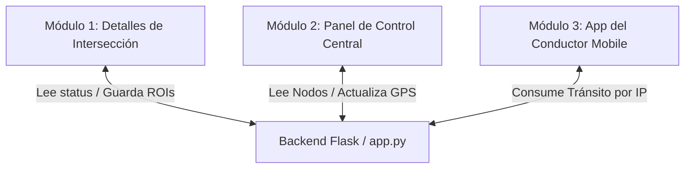

# Hoja de Especificaciones de Módulos - SmartCross

Este documento sirve como guía de referencia técnica para dividir el desarrollo, calibración y exposición del proyecto entre los integrantes del equipo. El sistema está seccionado en tres módulos independientes que comparten datos en tiempo real mediante API REST.

---

## 🛠️ Resumen de Integración del Sistema

El backend centraliza los datos de tráfico en memoria y expone endpoints. Los módulos interactúan de la siguiente manera:

---

## 🚦 Módulo 1: Detalles de una Intersección Inteligente (Detección en Vivo)

* **Objetivo**: Procesar el feed de video del dron (o simulación de carril), ejecutar la inferencia de visión artificial con YOLOv8, calcular las colisiones de vehículos dentro de las zonas de interés poligonales (ROIs S1–S4), y estimar el retraso aplicando las reglas de extensión de semáforos.
* **Responsable principal**: Encargado de Visión por Computador e Inferencia.

### Especificación de Archivos y Carpetas

#### 1. [app.py](file:///C:/Users/HAROLD/Documents/antigravity/mysterious-bardeen/app.py) (Sección de Visión e Inferencia)
* **Funciones Clave**: 
  - `video_processing_thread()`: Hilo en segundo plano encargado de leer el archivo de video (o generar la simulación vial en 2D), inicializar el modelo YOLOv8, y calcular qué vehículos entran en los polígonos.
  - `load_rois()` y `save_rois()`: Manejo del archivo JSON de coordenadas de calibración.
* **Endpoints Relacionados**:
  - `/video_feed`: Stream de video MJPEG con las bounding boxes de YOLOv8 y los overlays poligonales transparentes dibujados en tiempo real.
  - `/api/status`: Devuelve el JSON con el estado de congestión (Verde, Ámbar, Rojo), conteos suavizados, tiempos de espera y recomendaciones de segundos extra de verde para S1, S2, S3 y S4.

#### 2. [config.py](file:///C:/Users/HAROLD/Documents/antigravity/mysterious-bardeen/config.py)
* **Constantes Clave**:
  - `MODEL_PATH`: Peso del modelo YOLO (`yolov8n.pt`).
  - `CONFIDENCE_THRESHOLD`: Filtro de seguridad de confianza (0.25).
  - `COCO_CLASSES`: Filtro de clases COCO (`[2, 3, 5, 7]` correspondientes a autos, motos, buses y camiones).
  - `UMBRAL_BAJO` y `UMBRAL_ALTO`: Límites para determinar el color de alerta.
  - `SMOOTHING_FRAMES`: Tamaño de la cola del promedio móvil para suavizar lecturas.
  - `BASE_EXTRA_TIME`, `SECONDS_PER_VEHICLE`, `MAX_EXTRA_TIME`: Parámetros del motor de reglas para la extensión de verde.

#### 3. [rois.json](file:///C:/Users/HAROLD/Documents/antigravity/mysterious-bardeen/rois.json)
* **Formato**: Almacena las coordenadas normalizadas ($0.0$ a $1.0$) de los 4 accesos de la intersección (S1, S2, S3, S4) permitiendo escalar los polígonos sin importar la resolución del reproductor.

#### 4. [templates/interseccion.html](file:///C:/Users/HAROLD/Documents/antigravity/mysterious-bardeen/templates/interseccion.html)
* **Frontend**: Layout modular responsivo de la cámara en vivo (65%) y panel de semáforos por accesos (35%). Recibe parámetros Jinja2 de nombre y ID.

#### 5. [templates/setup.html](file:///C:/Users/HAROLD/Documents/antigravity/mysterious-bardeen/templates/setup.html)
* **Frontend**: Lienzo de calibración en vivo. Carga un frame estático del video y permite trazar puntos poligonales interactivos.

#### 6. [static/js/main.js](file:///C:/Users/HAROLD/Documents/antigravity/mysterious-bardeen/static/js/main.js)
* **Scripts**: Realiza peticiones AJAX tipo poll cada 500ms al endpoint `/api/status?id=...`, actualizando los badges numéricos, el encendido de los círculos semafóricos, los bloques de alertas del algoritmo de extensión de verde y los KPIs de pie de página.

#### 7. [static/js/setup.js](file:///C:/Users/HAROLD/Documents/antigravity/mysterious-bardeen/static/js/setup.js)
* **Scripts**: Manejo de eventos de clic en Canvas HTML5, persistencia local de puntos del polígono activo, traducción a coordenadas relativas y envío POST al servidor.

---

## 🗺️ Módulo 2: Panel de Control de las Intersecciones Inteligentes (Cuadro de Control Central)

* **Objetivo**: Integrar la información de todas las intersecciones inteligentes del distrito en una vista unificada. Renderiza el mapa georreferenciado, permite calibrar la posición de las intersecciones mediante drag-and-drop, y expone KPIs acumulados de tráfico distrital y de la onda verde.
* **Responsable principal**: Encargado de Integración Backend e Interfaces Web.

### Especificación de Archivos y Carpetas

#### 1. [app.py](file:///C:/Users/HAROLD/Documents/antigravity/mysterious-bardeen/app.py) (Sección de Rutas del Panel Central)
* **Funciones Clave**:
  - Simulación de fluctuación de tráfico para nodos inactivos (dentro del loop del thread principal).
  - Sincronización en memoria de la intersección activa.
* **Endpoints Relacionados**:
  - `/`: Carga la interfaz principal.
  - `/api/intersecciones`: Retorna el arreglo JSON completo con el estado de los 8 cruces.
  - `/api/update_interseccion_coords`: Recibe latitud y longitud modificados por el mapa y los actualiza de forma persistente.

#### 2. [intersecciones.json](file:///C:/Users/HAROLD/Documents/antigravity/mysterious-bardeen/intersecciones.json)
* **Formato**: Lista estructurada de diccionarios con las llaves `id`, `name`, `lat`, `lng`, `status`, `count`, y `corridor` para las 8 intersecciones (Av. Javier Prado, Vía Expresa, etc.).

#### 3. [templates/dashboard.html](file:///C:/Users/HAROLD/Documents/antigravity/mysterious-bardeen/templates/dashboard.html)
* **Frontend**: Estructura tipo split-view que integra la hoja de estilos de Leaflet, crea el elemento `#map` (65%) y apila los widgets de analíticas (35%): desglose de estados, tarjetas de KPIs generales (Congestión promedio, Espera, Total autos, Uptime), progreso de sincronización de onda verde, ranking Top 3, feed de incidentes y el SVG del gráfico de tendencia.

#### 4. [static/js/dashboard.js](file:///C:/Users/HAROLD/Documents/antigravity/mysterious-bardeen/static/js/dashboard.js)
* **Scripts**: 
  - Inicializa el mapa Leaflet en coordenadas de San Isidro.
  - Genera marcadores personalizados tipo `L.divIcon` con clases CSS reactivas y escuchas de arrastre `dragend`.
  - Dibuja la línea intermitente del corredor Av. Javier Prado.
  - Calcula las métricas acumuladas e incidentes y dibuja la línea de tendencia SVG.

#### 5. [static/css/custom.css](file:///C:/Users/HAROLD/Documents/antigravity/mysterious-bardeen/static/css/custom.css) (Sección de Leaflet)
* **Diseño**: Inversión de colores de los mapas (`filter: invert(100%)...`), estilos de tooltips oscuros, y animaciones de parpadeo y escala para los marcadores en color rojo.

---

## 📱 Módulo 3: App para el Usuario (Aplicación Móvil / App del Conductor)

* **Objetivo**: Proveer una interfaz orientada al celular del conductor (Mobile-First) para que reciba guías de tránsito fluidas en base a la geolocalización. Muestra el estado del tráfico, aconseja velocidades óptimas (GLOSA) para la onda verde, da instrucciones guiadas por voz (Text-to-Speech) y provee un simulador del recorrido (Demo Mode) para su presentación física.
* **Responsable principal**: Encargado de Desarrollo Móvil (React Native / Expo).

### Especificación de Archivos y Carpetas (Directorio `/driver-app/`)

#### 1. [driver-app/App.js](file:///C:/Users/HAROLD/Documents/antigravity/mysterious-bardeen/driver-app/App.js)
* **Secciones de Código**:
  - `DEFAULT_INTERSECTIONS`: Fallback de datos locales en memoria en caso de desconexión.
  - `DEMO_WAYPOINTS`: Arreglo de coordenadas GPS de paso interpoladas para simular el desplazamiento fluido del auto por Javier Prado.
  - `LEAFLET_MAP_HTML`: Cadena de texto que contiene el HTML y JavaScript de Leaflet inyectado en el `WebView`.
  - Componente `App()`: Maneja los estados de localización, pestañas de la app (Mapa, Métricas, Ajustes), control de Modo Conducción HUD, control de Modo Demo, temporizadores e interacción de voz con `expo-speech`.
  - Estilos de React Native (`StyleSheet.create`): Contiene la paleta visual oscura (`#13294B`, `#21A179`, `#F4C430`, `#E23B3B`) y botones táctiles adaptados a pantallas móviles.

#### 2. [driver-app/app.json](file:///C:/Users/HAROLD/Documents/antigravity/mysterious-bardeen/driver-app/app.json)
* **Expo Config**:
  - Identificadores y configuraciones del paquete.
  - Sección `ios.infoPlist.NSLocationWhenInUseUsageDescription`: Mensaje requerido por iOS para la solicitud del sensor GPS.
  - Sección `android.permissions`: Permisos del manifiesto de Android (`ACCESS_COARSE_LOCATION` y `ACCESS_FINE_LOCATION`).

#### 3. [driver-app/package.json](file:///C:/Users/HAROLD/Documents/antigravity/mysterious-bardeen/driver-app/package.json)
* **Dependencias**:
  - `expo`: SDK versión 54.
  - `react-native-webview`: Motor del navegador embebido para el mapa interactivo.
  - `expo-location`: Puente del sensor GPS nativo.
  - `expo-speech`: Motor nativo de Text-to-Speech para alertas por voz.

#### 4. [driver-app/README.md](file:///C:/Users/HAROLD/Documents/antigravity/mysterious-bardeen/driver-app/README.md)
* **Guía**: Instrucciones para iniciar el CLI de desarrollo, escanear el QR desde el móvil usando la app **Expo Go** y emparejar la IP de la computadora de Flask.
